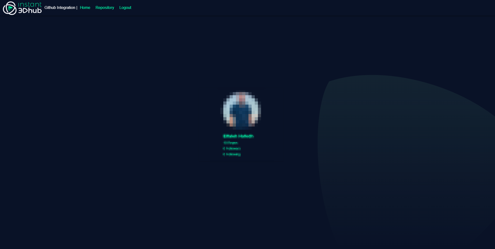

# Example: GitHub Gateway Integration 

## Description

instant3Dhub can be used to read and visualise data from external systems. This example shows how to integrate it with GitHub to visualize 3D data from a private repository and addressing the data using a [URN schema](https://docs.threedy.io/3.6.2/doc/integration/URN_MAPPER.html).

---
## Table of contents
---

- [GitHub Gateway Integration](#example-github-gateway-integration)
  - [Description](#description)
  - [Table of content](#table-of-contents)
  - [Components](#components)
    - [App](#app)
    - [Data Gateway](#data-gateway)
    - [OAuth Proxy](#oauth-proxy)
    - [Instant3dhub](#instant3dhub)
  - [Setup](#setup)
    - [Prerequisites](#prerequisites)
    - [Run the example](#run-the-example)
  - [User Guide](#user-guide)
- [License](#license)
- [How to report an issue](#how-to-report-an-issue)

## Components


This example consists of the components listed below. 

## App 
The provided [app](./app/) is a React App which integrates the instant3Dhub client library webvis.js. The following functionality is implemented:

- Login with GitHub account 
- List files that are available in the GitHub repository
- Visualize 3D files 

## OAuth proxy:

The [OAuth Proxy](./oauth-proxy/) is an [expressjs server](https://expressjs.com/) that uses the code that was retrieved by the app login flow to retrieve an access token. The access token is provided to the App to access the data.

## Data Gateway: 

The [data gateway](./github-gw/) is a go service which exposes an HTTP endpoint implementing 2 methods:

  - GET: Gets the raw file data with the current user context
  - HEAD: Check if the current user context is authorized to access a specific file

The gateway checks Authorization header to pass the user access token.
The sha of the file is set as ETag header to identify if the orginal file has changed and needs to be reloaded into instant3Dhub. More information about Gateway interface is available [here](https://docs.threedy.io/3.6.2/doc/microservices/3ddata/api.html).

## instant3Dhub 

A running instance of instant3Dhub is needed to run the example with the [correct configuration](./github-gw/i3dhub-config/values.yaml). For information on how to install instant3Dhub and apply configuration, please check our public [documentation portal](https://docs.threedy.io/3.6.2/doc/integration/README.html).
We also provide a helm chart package in this repository that uses instant3Dhub as a dependency. The provided helm chart can be used to install all components. See [setup](#setup).


# Setup


## Prerequisites
To run this example, you need to have the following:
- Installed Docker
- Kubernetes cluster

The following section explains how to run on Windows using [docker desktop](https://www.docker.com/products/docker-desktop/)

## Run the Example
- Register [new OAuth APP](https://docs.github.com/en/apps/oauth-apps/building-oauth-apps/creating-an-oauth-app) in GitHub.
- Copy the client ID and secret to use in the following step. 
- Build docker images:
  
  ```
  docker build -t i3dhub-github-app app/
  docker build -t i3dhub-github-gateway github-gw/
  docker build -t i3dhub-github-auth-proxy oauth-proxy/
  ```

- Use [helm chart](./helm/) to install the components. Note that this chart uses instant3Dhub version 3.6.1. You can change the used version in [chart.yaml](./helm/Chart.yaml).

- In case you want to install instant3Dhub with the other components, you need to update the helm depedency based on the contents of Chart.yaml

  ```
  cd helm && helm dependency update 
  ``` 

- Install the package: 

  Replace CLIENT_ID, CLIENT_SECRET, REPOSITORY_NAME with the correct values in the following command.

  In case you have installed instance3Dhub separately, you can skip its installation by 
  setting instant3Dhub.enabled=false and set hubURL value app.hubURL=<hub-url>. In addition you can omit all the other instant3Dhub.* values in the command.

  ```
  #!/bin/bash

  helm install i3dhub-github-integration  ./helm/ \
    --create-namespace \
    --namespace i3dhub-github-integration \
    --set app.enabled=true \
    --set app.clientId= CLIENT_ID \
    --set app.clientSecret= CLIENT_SECRET \
    --set app.redirectURL=http://localhost:30080/login \
    --set app.authProxy.url=http://localhost:30081/authenticate \
    --set app.authProxy.nodePort=30081 \
    --set app.nodePort=30080 \
    --set app.repositoryName= REPOSITORY_NAME \
    --set app.hubURL=http://localhost:30042/ \
    --set image.registry=images.threedy.io:8082 \
    --set instant3Dhub.enabled=true \
    --set instant3Dhub.licenseServer=http://license.threedy.io:8200 \
    --set instant3Dhub.entrypoints={http://localhost:30042/} \
    --set instant3Dhub.entryNodePort=30042 \
    --set instant3Dhub.storage.class=hostpath \
    --set instant3Dhub.registry=images.threedy.io
  ```

## User guide

- Install the package

- Then enter the url ```<HOST>:<PORT>``` will loads the login page 


- Login with your GitHub account  it will redirect you to the home page with some information about your GitHub profile 




- Navigate to the Repository tab it will show a list of the files from your private repository  and Instant3Dhub.
By clicking plus Button the file will be Visualized with the Webvis


---
# License
This example is provided under the terms of the MIT License. Please see the [LICENSE](./LICENSE) for full details.
 

# How to report an issue
For any issues please [contact us](mailto:github-threedy@threedy.io).