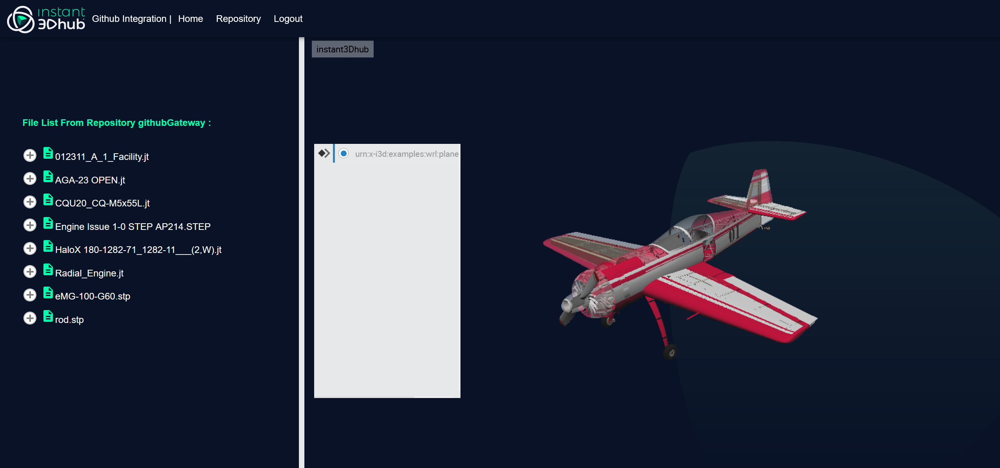

## Table of content:
---
- [Table of content:](#table-of-content)
- [Description:](#description)
- [How to use the example](#how-to-use-the-example)
- [Thumbnail](#thumbnail)
- [License:](#license)
- [How to report an issue.](#how-to-report-an-issue)

---

## Description:
Github-integration is a simple application that shows how to integrate webvis with Github using ReactJS.
- In this example we have implemented :
  - How to work with Github API using ReactJS.
  - How to signin with Github.
  - How to get personal information from Github.
  - How to get authorized data from private repository.
  - how to pass authorization to webvis and visualize data.
  


---

## How to use the example
This sample example is based on [webvis API](https://docs.threedy.io/3.6.1/index.html) and the  [ReactJS documentation](https://reactjs.org/docs/getting-started.html).

- Setup

    - Clone this repo.
    - Login to your Github account and create an OAuth app by following the steps provided here 
    (https://docs.Github.com/en/free-pro-team@latest/developers/apps/creating-an-oauth-app).
     Note: For this example, while creating the OAuth app, you can set your Homepage URL to http://localhost:3000/ and
     Authorization callback URL to http://localhost:3000/login if you are running your app locally.

    -  `Env variables` :
  
        - Create a .env file in the app folder and set these variables: 
           ```
           REACT_APP_CLIENT_ID=Your Client ID from Github
           REACT_APP_REDIRECT_URI=http://localhost:3000/login
           REACT_APP_PROXY_URL=http://localhost:5000/authenticate
           SERVER_PORT=5000
           REACT_APP_REPOSITORY_NAME=Repo Name
           REACT_APP_URl_HUB=Link to the used webvis instance
           GENERATE_SOURCEMAP=false
           ```
        - Create a .env file in the server folder and set these variables: 
           ```
           REACT_APP_CLIENT_ID=Your Client ID from Github
           REACT_APP_CLIENT_SECRET=Your Client Secret from Github
           REACT_APP_REDIRECT_URI=http://localhost:3000/login
           REACT_APP_PROXY_URL=http://localhost:5000/authenticate
           SERVER_PORT=5000
           ```

    - On both folders app and server run:
      - `npm install`

          - To install all the dependencies.
      - `npm start`

          - Runs the app in the development mode.
- Run
    - Open [http://localhost:3000](http://localhost:3000) to view it in the browser.


## Thumbnail
---


---
## License:
This sample is licensed under the terms of the MIT License. Please see the LICENSE file for full details.
 

## How to report an issue.
For any report please [contact us](https://i3dhub.atlassian.net/servicedesk/customer/portal/2).